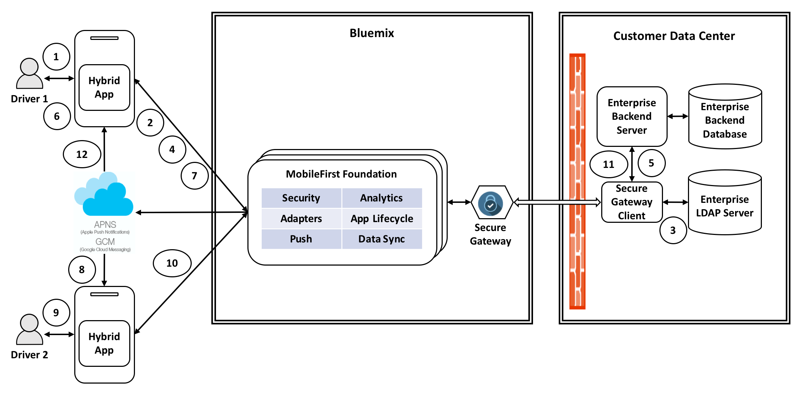

# MobileFoundation-EnterpriseBackend-RouteSwap

1. Driver opens the mobile app, enters his enterprise credentials on the login screen and clicks *Login*. 
2. Credentials are sent to the MobileFirst adapter for authentication.
3. MobileFirst adapter makes a call to the enterprise LDAP server through Secure Gateway to validate user credentials.
4. If authentication is successful, the app proceeds to fetch the driving routes assigned to current user and his peers by making a call to MobileFirst adapter.
5. MobileFirst adapter fetches the route information by making a call to enterprise backend server through Secure Gateway, and returns that information to the mobile app for displaying to user.
6. Driver sees the routes assigned to himself and his peers, and prefers to swap routes with one of his peers. He clicks *Swap Route* button, specifies the routes that he prefers to swap, and clicks *OK*.
7. Mobile app makes a call to MobileFirst adapter to trigger the route-swap process.
8. MobileFirst adapter sends a push notification to the other driver.
9. Other driver receives a route-swap push notification. Upon clicking the message in notification bar, app is launched and route-swap request is shown. He sees buttons to either *Accept* or *Reject* the swap request. This driver accepts the swap request. 
10. Mobile app makes a call to MobileFirst adapter to notify the response from this driver.
11. Upon receiving the route-swap acceptance from second driver, MobileFirst adapter updates the backend server with swapped routes.
12. MobileFirst adapter sends a push notification to the first driver informing him of the successful acceptance of his route-swap request.
